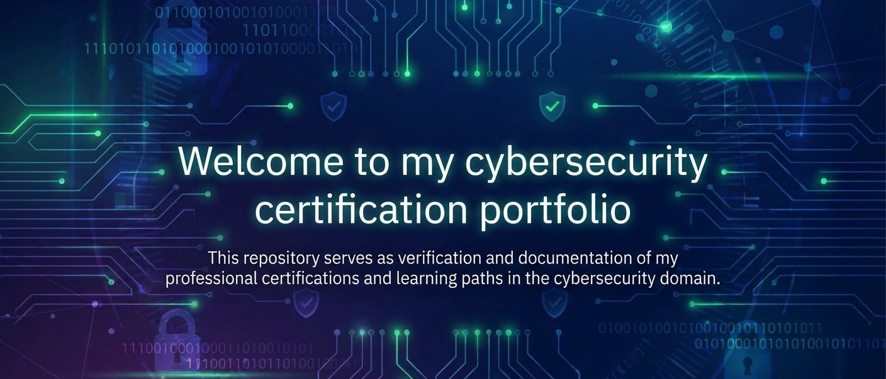

<h1 align="center"> 🛡️ Cybersecurity Certifications Portfolio 🛡️ </h1>

## 🎓 Certifications

### 1. Google Cybersecurity Certificate
- **Issuer:** Google / Coursera  
- **Focus Areas:** Security foundations, risk management, Linux, Phyton, SQL and incident handling.  
- **Certificate:** [View Google Cybersecurity Certificate](https://github.com/Arfrd98/Cybersecurity-Certifications/blob/main/certificates/Coursera%20Cyber%20Security.pdf)
- **Verification:** [View Certificate on Coursera](https://www.coursera.org/account/accomplishments/professional-cert/GD30E34GRMHF) 
- **Date Issued:** July 2025  

---

### 2. Cisco Junior Cybersecurity Analyst Career Path
- **Issuer:** Cisco Networking Academy  
- **Focus Areas:** Basic Cybersecurity Concept, Threat Detection, Networking Devices and Initial Configuration, Cyber Threat Management, and Endpoint Security.
- **Certificate:** [View Junior Cybersecurity Analyst Career Path Certificate](https://github.com/Arfrd98/Cybersecurity-Certifications/blob/main/certificates/Junior_Cybersecurity_Analyst_Career_Path_certificate.pdf)
- **Verification:** [View on Credly](https://www.credly.com/badges/049e648c-b5f1-48cb-b3b6-6cc657308c21/linked_in_profile) 
- **Date Issued:** September 2025

---

### 3. Huawei Network Security
- **Issuer:** Huawei Talent Online  
- **Focus Areas:** Network Security Fundamentals, Firewall Configuration, and Vulnerability Management.  
- **Certificate:** [View Huawei Network Security Certificate](https://github.com/Arfrd98/Cybersecurity-Certifications/blob/main/certificates/Huawei%20Network%20Security.png)
- **Credential ID:** EBG20250930000002
- **Date Issued:** September 2025
  
---

### 4. ISC2 Certified in Cybersecurity (CC)
- **Issuer:** (ISC)²  
- **Focus Areas:** Cybersecurity Principles, Incident Response, Business Continuity and Disaster Recovery Concept, Network Security, and Risk Management.   
- **Certificate:** [View (ISC)² CC Certificate](https://github.com/Arfrd98/Cybersecurity-Certifications/blob/main/certificates/ISC2%20CC.pdf)
- **Verification:** [View on Credly](https://www.credly.com/badges/97122a06-056d-47ce-a1f8-a2c45af83892/linked_in_profile)
- **Date Issued:** September 2025

---

### 5. CompTIA Cybersecurity Analyst (CySA+)
- **Issuer:** CompTIA 
- **Focus Areas:** Threat & Vulnerability Management, Security Operations & Monitoring, Incident Response, and Threat Intelligence & Analysis.   
- **Certificate:** [View CompTIA CySA+ Certificate](https://github.com/Arfrd98/Cybersecurity-Certifications/blob/main/certificates/CompTIA%20CySA%2B%20certificate.pdf)
- **Verification:** [View on Credly](https://www.credly.com/badges/b21807b7-65f8-4511-b947-0ae8b4e3c37d/linked_in_profile)
- **Date Issued:** November 2025

---

### 6. LFC108: Cybersecurity Essentials 
- **Issuer:** The Linux Foundation 
- **Focus Areas:** Cybersecurity Foundation.   
- **Certificate:** [View LFC108: Cybersecurity Essentials Certificate](https://github.com/Arfrd98/Cybersecurity-Certifications/blob/main/certificates/TheLinuxFoundation%20LFC108.pdf)
- **Verification:** [View on Credly](https://www.credly.com/badges/f2833c32-a7f7-4e33-8575-25ab2c831233/public_url)
- **Date Issued:** December 2025

---

### 7. Advent of Cyber 2025 
- **Issuer:** TryHackMe
- **Focus Areas:** Blue Team & Defensive Security, Threat Analysis & Malware Basics, Operating System Security and OSINT & Digital Investigation
- **Certificate:** [View TryHackMe - Advent of Cyber 2025 Completion Certificate](https://github.com/Arfrd98/Cybersecurity-Certifications/blob/main/certificates/THM-Advent%20of%20Cyber%202025.pdf)
- **Date Issued:** December 2025

---

## 🌐 Profiles & Learning Platforms
- [TryHackMe Profile](https://tryhackme.com/p/Soaz)
- [Medium Profile](https://medium.com/@Arfrd)
- [LinkedIn Profile](https://www.linkedin.com/in/arif-farid)

